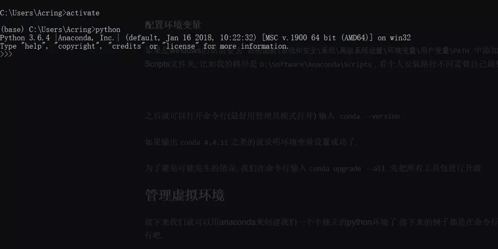
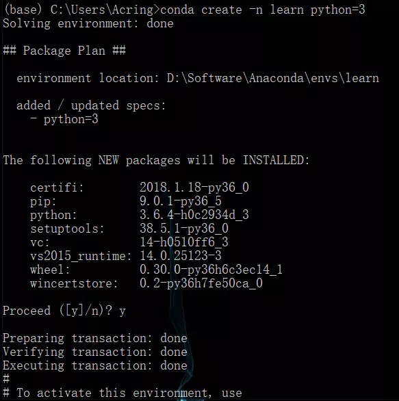

# Python requests使用教程

参考文章链接：https://www.liaoxuefeng.com/wiki/1016959663602400/1183249464292448

## 为什么用requests

Python内置的urllib模块，用于访问网络资源。但是，它用起来比较麻烦，而且，缺少很多实用的高级功能。

更好的方案是使用requests。它是一个Python第三方库，处理URL资源特别方便。

## 管理虚拟环境

接下来我们就可以用anaconda来创建我们一个个独立的python环境了.接下来的例子都是在命令行操作的,请打开你的命令行吧.

### activate

activate 能将我们引入anaconda设定的虚拟环境中, 如果你后面什么参数都不加那么会进入anaconda自带的base环境,

你可以输入python试试, 这样会进入base环境的python解释器, *如果你把原来环境中的python环境去除掉会更能体会到*, 这个时候在命令行中使用的已经不是你原来的python而是base环境下的python.而命令行前面也会多一个`(base)` 说明当前我们处于的是base环境下.



### 创建自己的虚拟环境

我们当然不满足一个base环境, 我们应该为自己的程序安装单独的虚拟环境.

创建一个名称为learn的虚拟环境并指定python版本为3(这里conda会自动找3中最新的版本下载)

```bash
conda create -n learn python=3
```



于是我们就有了一个learn的虚拟环境, 接下来我们切换到这个环境, 一样还是用activae命令 后面加上要切换的环境名称

### 切换环境

```bash
activate learn
```

如果忘记了名称我们可以先用

```bash
conda env list
```

去查看所有的环境

现在的learn环境除了python自带的一些官方包之外是没有其他包的, 一个比较干净的环境我们可以试试

先输入`python`打开python解释器然后输入

```python
>>> import requests
```

会报错找不到requests包, 很正常.接下来我们就要演示如何去安装requests包

```python
>>> exit()
```

退出python解释器

### 安装第三方包

输入

```bash
conda install requests
```

或者

```bash
pip install requests
```

来安装requests包.

安装完成之后我们再输入`python`进入解释器并import requests包, 这次一定就是成功的了.

### 卸载第三方包

那么怎么卸载一个包呢

```bash
conda remove requests
```

或者

```bash
pip uninstall requests
```

就行啦.

### 查看环境包信息

要查看当前环境中所有安装了的包可以用

```
conda list 
```

### 导入导出环境

如果想要导出当前环境的包信息可以用

```bash
conda env export > environment.yaml
```

将包信息存入yaml文件中.

当需要重新创建一个相同的虚拟环境时可以用

```bash
conda env create -f environment.yaml
```

> activate // 切换到base环境
>
> activate learn // 切换到learn环境
>
> conda create -n learn python=3 // 创建一个名为learn的环境并指定python版本为3(的最新版本)
>
> conda env list // 列出conda管理的所有环境
>
> conda list // 列出当前环境的所有包
>
> conda install requests 安装requests包
>
> conda remove requests 卸载requets包
>
> conda remove -n learn --all // 删除learn环境及下属所有包
>
> conda update requests 更新requests包
>
> conda env export > environment.yaml // 导出当前环境的包信息
>
> conda env create -f environment.yaml // 用配置文件创建新的虚拟环境