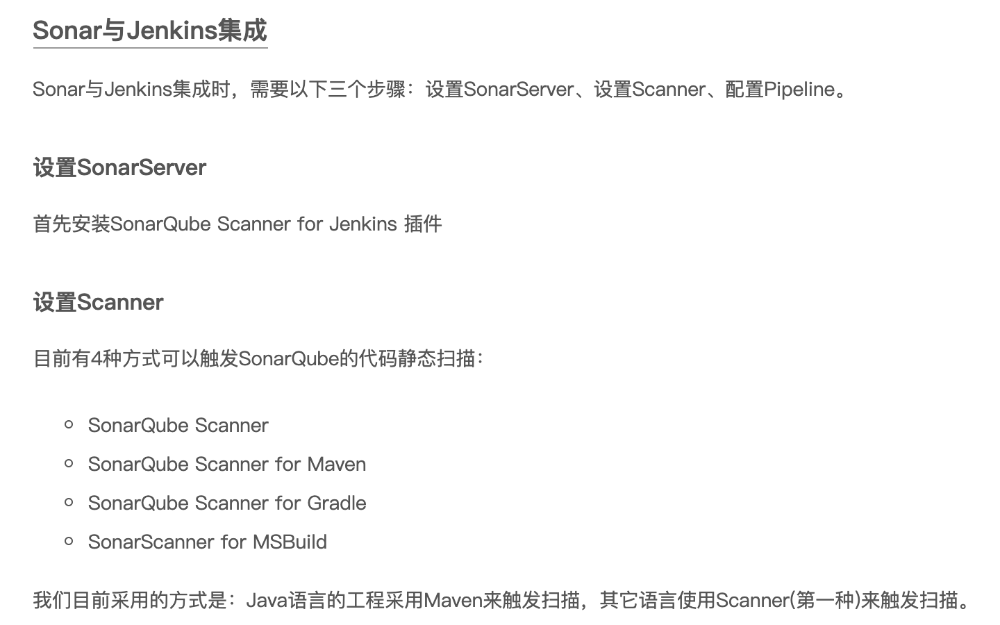
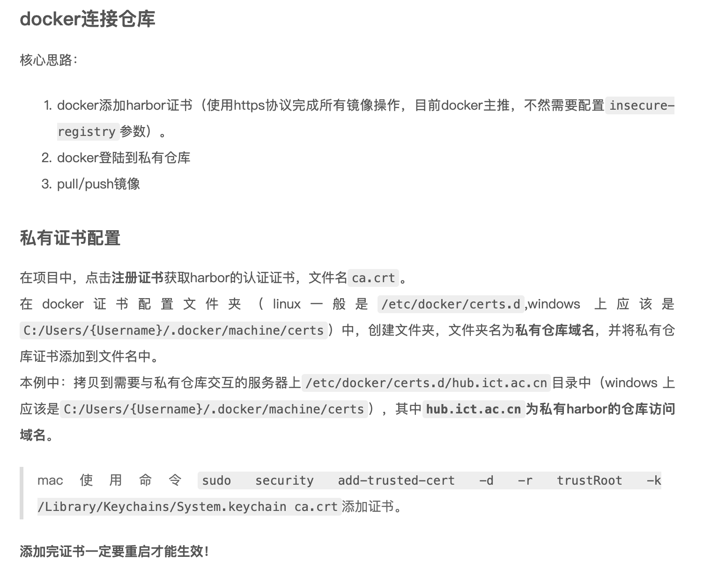
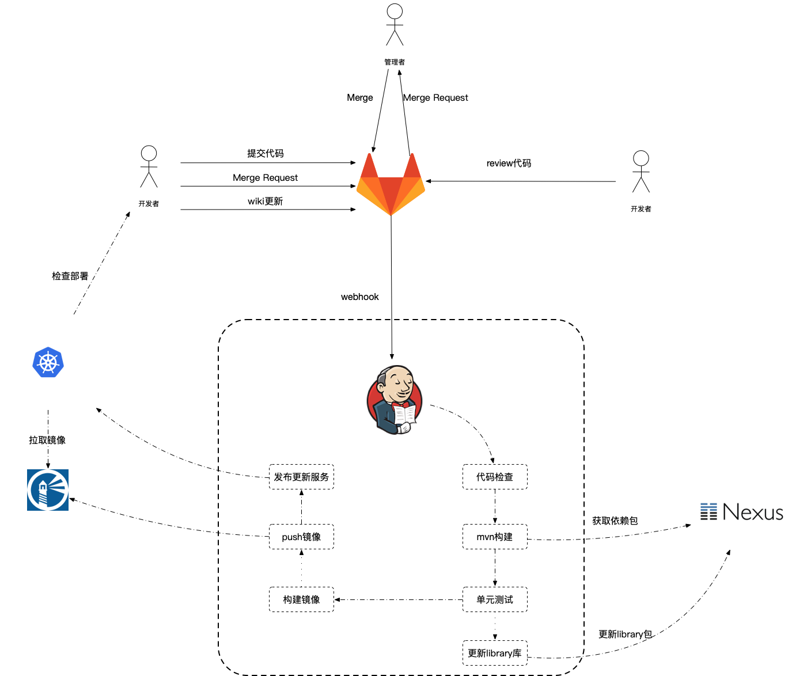

# 新手任务

## 一、使用gitlab

### 1、创建工程

​	在网页端创建工程，填写工程信息

### 2、关联代码

#### Git 的基本流程如下：

​	1、创建或修改文件

​	2、使用 `git add` 命令添加新创建或修改的文件到本地的缓存区（Index）

​	3、使用 `git commit` 命令提交到本地代码库

​	4、（可选，有的时候并没有可以同步的远端代码库）使用`git push`命令将本地代码库同步到远端代码库

[Git 实战教程](https://www.shiyanlou.com/courses/4)

[Github 快速上手实战教程](https://www.shiyanlou.com/courses/868)

#### 命令：

**git config**：配置相关信息 

**git clone**：复制仓库 

**git init**：初始化仓库 

**git add**：添加更新内容到索引中 。

使用 `git add` 命令将新建的文件添加到缓存区，为 `commit` 做好准备。

再次执行 `git status` 就会发现新的变化。

可以使用 `git diff` 命令再加上 `--cached` 参数，看看缓存区中哪些文件被修改了。如果没有`--cached`参数，`git diff` 会显示当前你所有已做的但没有加入到缓存区里的修改。

**git diff**：比较内容 

**git status**：获取当前项目状况。使用 `git status` 命令查看当前 Git 仓库的状态

**git commit**：使用 `git commit` 提交修改 

当所有新建，修改的文件都被添加到了缓存区，我们就要使用 `git commit` 提交到本地仓库：

```shell
$ git commit -m "add 3 files"
```

需要使用 `-m` 添加本次修改的注释，完成后就会记录一个新的项目版本。除了用 `git add` 命令，我们还可以用下面的 `-a` 参数将所有没有加到缓存区的修改也一起提交，但 `-a` 命令不会添加新建的文件。

```shell
$ git commit -a -m "add 3 files"
```

再次输入 `git status` 查看状态，会发现当前的代码库已经没有待提交的文件了，缓存区已经被清空。

**git branch**：分支相关

**git checkout**：切换分支

**git merge**：合并分支

**git reset**：恢复版本

**git log**：查看日志 。`git log` 命令可以显示所有的提交（commit）

**git push**：将修改推到一个公共仓库。

通过 http 或是 git 协议，其它维护者可以通过远程访问的方式抓取（fetch）你最近的修改，但是他们没有写权限。如何将本地私有仓库的最近修改主动上传到公共仓库中呢？

最简单的办法就是用 `git push` 命令，推送本地的修改到远程 Git 仓库，执行下面的命令:

```shell
$ git push ssh://服务器仓库地址 master:master
```

或者：

```shell
$ git push ssh://服务器仓库地址 master
```

`git push` 命令的目地仓库可以是 `ssh` 或 `http/https` 协议访问。

## 二、sonar



==没有这个token，本地不用连server。Jenkins流程照写，貌似在服务端自动就能过。？？？==

## 三、如何使用harbor管理docker镜像

harbor的账户开好了，与开发机的账户相同

开发服务器 172.22.0.14 和 172.22.0.24 帐号如下。其中 14 的操作系统是 CentOS7 可以进行docker相关操作，24的操作系统是 CentOS6.5。

fengbin / Mr7QC$LWb5



==在项目中，点击**注册证书**获取harbor的认证证书，文件名`ca.crt`。??==

## 四、如何使用nexus下载上传开发包(暂时不需要)

Nexus 全称 Nexus Repository OSS 3 是一个开源的仓库管理系统，它提供了丰富的仓库管理管理功能，使用起来非常方便。

OSS 3目前支持的仓库如下：

- bower

- docker，Docker镜像

- maven，基于Maven管理的jar包

- npm，node相关的package

- pypi，python相关的package

- raw

- rubygems

- yum

	…

哈哈，过！

## 五、jenkins使用说明

持续集成工具，用于代码的自动化构建、发布

### 访问地址
### 查看jenkins持续集成日志
### 添加pipeline

## 六、docker使用说明

系统基础运行环境

### 学习docker的核心目标

使用Dockerfile打包镜像， 由于后面使用kubernetes，所以不需要掌握`docker-compose`，如果感兴趣可自行学习。

### 操作

1. 打包镜像
2. 检索镜像
3. 拉取镜像
4. 推送镜像
5. 运行镜像，变量
6. 查看系统中运行的镜像

## docker 连接私有仓库

==参考harbor教程==

## 七、kubernetes应用部署和自动化运维工具

## kubernetes 上部署的公共服务

1. helm
2. harbor
3. wayne

## 八、wayne操作说明 

操作主要思路：

1. 关联集群
2. 添加命名空间
3. 添加人员
4. 添加项目
5. 添加部署
关联过程中需要kubelet config。

### 关联集群

### 添加命名空间

添加命名空间前需要添加kubernetes集群

## 九、核心流程

目前实验室持续集成流程如下：



1. 开发者push代码到git仓库；

2. gitlab触发jenkins构建；

3. 静态代码分析

4. jenkins编译和构建代码

5. 单元测试

6. 测试通过的代码自动打包

	1. 独立运行程序打包成镜像，发布到harbor
	2. 代码包发布到nexus

7. jenkins通知kubernetes更新服务

8. kubernetes接收到更新，自动拉取最新的镜像，更新服务。

	