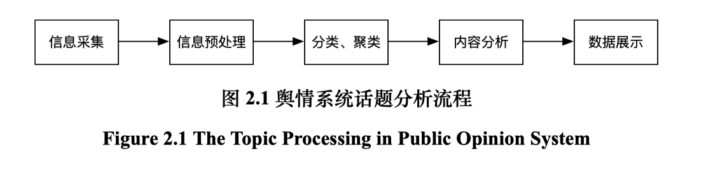

# 《面向舆情场景的话题推荐方法研究》笔记

## 摘要：

构建能够及时发现并掌握舆情的发展与演化过程、辅助舆情用户作出相应的决策并采取行动、避免舆情恶化造成负面影响的网络舆情系统。

本文尝试针对场景的特点使用深度推荐模型为用户推荐话题信息。

本文主要工作内容如下：

1. 基于层次知识嵌入的话题推荐方法

	模型通过对层次知识、话题与用户建模得到其嵌入表示，然后利用匹配模型预测用户点击率，并通过对比实验验证了本方法在指标上的提升。

2. 结合流行因素的话题推荐方法

	故在基于层次知识的基础上加入流行因素，提出了结合流行因素的话题推荐方法，同时考虑了舆情用户对内容相关性与流行性的需求。

3. 面向舆情场景的话题推荐子系统	

	在基于层次化知识嵌入的话题推荐方法和结合流行因素的话题推荐方法的研究基础上，本文设计并实现了面向舆情场景的话题推荐子系统。
	
## 第1章 引言

以话题检测与话题推荐为代表的网络舆情事件快速发现 与精准化信息推送手段在舆情场景应用中得到广泛的关注。

• **基于层次化知识嵌入的话题推荐模型**，针对舆情场景下用户对未知舆情的 兴趣难以刻画的问题，模型通过层次化知识表示模块与话题表示模块利用层次 化知识和用户历史记录学习用户嵌入表示，不仅能有效的捕捉用户的个性化需 求，更能利用层次化的知识信息有效的的扩展用户兴趣范围再使用语义匹配模 块使用用户嵌入与候选话题嵌入预测用户点击率。最后本文通过对比实验，验证 了本模型的效果。

• **结合流行因素的话题推荐模型**，针对舆情用户倾向于关注可能产生重大影 响的舆情，模型以利用层次知识语义的层次知识嵌入话题推荐为基础，探索了结 合流行因素的话题推荐方法，来改善基于内容的推荐导致的窄化，以及缺乏新颖 性的问题，满足舆情用户对流行内容的偏好。最后通过与 LibFM、Wide & deep、 DeepFM 等模型的对比实验证明了本模型的效果。

• **面向舆情场景的话题推荐子系统**，系统基于以上两点研究上进行设计并实现。并充分考虑了与现有的舆情系统的兼容性，设计了具有类似 ORM 的对象映 射功能的数据操作层，对上层屏蔽了具体的异构数据库之前的差异，增加了一层 数据操作抽象，使得系统更易于移植与改造，也实现了对上层对不同数据库操作 的解耦；另一方面为了便于调用设计并实现了简洁的符合 RESTful 规范的交互 接口，使得系统具有了良好的封装与可移植性。最后推荐算法核心模块的设计， 使得子系统具有了良好的扩展性，方便加入新的推荐模型与已有的系统进行集成。

## 第2章 相关工作及国内外研究现状

### 2.1 舆情场景相关工作

#### 2.1.1 话题分析简介

舆情系统中话题分析主要由以下五个数据处理部分组成：

#### 2.1.2 话题检测与跟踪

##### 2.1.2.1 话题模型与相似度

话题模型是为了便于计算和比较的数学的表示，为话题检测和跟踪等任务 的基础。常见的主要有向量空间，概率检索模型与语言模型 [2]，相似度为文档 与文档、话题与话题以及文档与话题之间的相似度。一般相似度与话题模型相关。

##### 2.1.2.2 话题检测

话题检测（Topic Detection Task）在 TDT 中任务是在缺乏话题先验知识的情 况下进行检测，将同一个话题的对象归为一类，形式上看与聚类目标相近，故而 目前大部分相关研究集中在使用聚类方法来进行话题检测。聚类算法按不同标 准有很多分类，如基于划分的聚类、基于模型的聚类、基于密度的聚类等，较为 常见的有 K-Means、BRICH、SinglePass 等聚类算法。

最后在舆情系统中 SinglePass 聚类算法 [4] 也是一种效果较好的流式聚类算 法，适合于在线聚类。其基本思路是，在遇到一个新的对象是，计算其与之前出现的所有对象的相似度，若最大相似度大于给定的阈值则，将其与之合并为一 类，否者说明其与所有对象的距离均大于阈值，其单独为一类。

以上提到的聚类算法均为比较常见的，目前舆情场景下跟多的工作是基于 已有的聚类算法，结合舆情场景的特点进行改进。除此之外还有一类基于概率生 成模型的话题检测方法，包括 pLSA[5] 和 LDA[6]，以及其改进算法等。

##### 2.1.2.3 话题跟踪

话题跟踪（Topic Tracking Task）主要是跟踪已知话题的后续报道，其中话 题没有明确描述，仅通过相关文档隐式给出。但是这与话题检测已经截然不同， 话题检测为无监督学习问题，而话题跟踪则是有监督的学习问题，相对而言更为 明确。一般的机器学习分类算法如 KNN、SVM 等模型亦可以被应用到此任务。

### 2.2 推荐方法相关工作

推荐系统可以提升整体的消费量、提升消费 的多样性、增加用户满意度、忠诚度及更好的理解用户需求，有效解决信息过载 的问题让用户及时、有效的发现其感兴趣的内容，使用户更高效地获取信息。推 荐系统粗略来看可以简单的分为出现较早的传统推荐模型与近些年研究较多的 基于深度学习的推荐模型。

#### 2.2.1 传统推荐模型

##### 2.2.1.1 协同过滤推荐

协同过滤的主要是使用用户评分或用户行为（如购买、浏览、点击等）来给 用户进行推荐，无需用户相关或物品相关的信息。可以分为基于 用户的协同过滤 [7] 以及基于物品的协同过滤 [8] 算法。

协同过滤中相似性的计算：

- Jacacard 距离

- 余弦相似度

- Pearson 相似度（其考虑到了用户评分的偏差，积极的用户会倾向于打高分，而严苛的用户可能倾向打低分，所以 使用打分均值可以消除此影响）消除了偏差。

以上基于相似度的协同过滤模型也被称为近邻协同过滤模型，主要特点是计算相似度，然后利用相似的近邻预测得分再去推荐。由于考虑了多个近邻所以算法具有较好的全局性，另外算法也具有较好的可解释性。

与之相对的还有一种**基于矩阵分解的协同过滤模型**，这类模型重点在于挖 掘用户-物品评分矩阵中的潜在特征。包括 pLSA[5]、LDA[6] 以及基于用户-物品 评分矩阵分解的如 SVD、SVD++[9] 等方法。这些方法会根据评分矩阵分解出潜 在的用户与物品的向量表示，然后使用这些潜在因子去预测评分。**总的来看,这些算法都是根据用户或者物品的历史记录来协同过滤的推荐算法。**

##### 2.2.1.2 基于内容的推荐

首先学习出物品 的表示，再根据用户的历史记录得到用户的的表示。在推荐物品的时候计算需要 推荐的物品与用户之前的相似度生成推荐列表进行展示，用户根据展示进行反 馈，得到反馈后可以更新用户表示，形成一个信息闭环。利用相关性分数，来预测目标用户对这些项目的兴趣水平。

**基于关键词的向量空间模型**

典型权重为TF-IDF 或是其他统计特征

余弦相似度$sim(d_i,d_j)$

**用户画像学习**

可以采用贝叶斯方法学习每个词项出现时用户对该文档感兴趣的概率，这些概率即为用户画像，然后可以依此来计算用户对每个文档感兴趣的概率。

##### 2.2.1.3 基于内容语义的推荐方法CBRS

总体上，我们可以将语义相关的内容推荐方法分为自顶向下与自底向上的两类， 前者主要在于集成外部知识到推荐系统中，知识可以是词典、知识图谱等；而自 底向上的方法在于通过大量语料中词项的上下文来学习其分布式表达，这便两者的根本区别。

**自顶向下的语义方法**

**自底向上的语义方法**

##### 2.2.1.4 混合推荐模型

加权混合

切换混合

分层混合

##### 2.2.1.5 传统模型小结

#### 2.2.2 深度推荐模型

##### 2.2.2.1 基于多层感知机的推荐模型

多层前馈网络已经被证明能够将任何可测量的函数逼近任何所需的精度 [22]，也是许多先进模型的基础。

如 2017年提出的DeepFM 模型，其架构如图2.5d所示，是 一种端到端模型，无缝集成了因子分解机和 MLP。

DeepFM 的预测结果可以写为$y = sigmoid(y_{FM} + y_{DNN} )$

FM 部分是即因子分解机，深度部分是一个前馈神经网络。

##### 2.2.2.2 基于卷积神经网络的推荐系统

卷积神经网络在处理视觉，文本和音频信息方面非常强大。大多数基于 CNN 的推荐系统利用 CNN 进行特征提取。

如 Gong 和 Zhang [25]提出了一种基于注 意力的 CNN 系统，用于微博中的＃标签推荐。

如  Wang 等 [26] 提出的 DKN 模型，通过结合实体嵌入，单词嵌入以及 实体上下文来学习新闻表达，然后利用注意力机制结合用户浏览记录来学习用 户表达。最后根据学到的用户表达和候选新闻表达联合计算，用户点击该条新闻 的概率。其中的知识学习网络就是利用 CNN 层学习文本特征。

##### 2.2.2.3 基于递归神经网络的推荐系统

递归神经网络特别适用于处理推荐系统中与时间动态相关的评分以及序列特征。

四种基于 RNN 的深度推荐模型：

Hidasi 等 [27] 提出了一种基于 GRU 的会话推荐模型；

Tan 等 [28]在此基础上提出了一个改进模型，主要在于输入改为点击序列、并加入了 dropout 层、以及预训练以及项目嵌入等技巧改进。

Wu 等 [29]在真实的电子商务场景中提出了一个基于会话的推荐模型。它利用基本 RNN 根据点击历史预测用户下次购买的内容。为了最小化计算成本，它只保留有限数量的最新状态，同时将旧状态折叠成单个历史状 态。该方法有助于平衡计算成本和预测准确性之间的权衡。

Li 等 [30]提出了一种基于 LSTM 的模型用于标签推荐，这项工作利用 RNN 和注意机制的优势来捕获顺序属性并识别来自微博帖子的信息词。首先，该模型使用 LSTM 来学习微博帖子的隐藏状态 $[h_1 , h_2 , h_3 , ..., h_N ]$。 同时，使用主题模型 LDA 来学习帖子的主题分布。最后通过一系列非线性变换和 softmax 归一化之后，从该分布获得主题的注意力权重 $[a_1 , a_2 , a_3 , ..., a_N ]$，然后 得到模型输出。

##### 2.2.2.4 深度语义匹配模型

在搜索场景中 Huang 等 [31]最先提出了深度结构语义模型（Deep Structured Semantic Model, DSSM），模型需要计算查询与所有候选文档的表示， 然后利用得到的表示计算查询与文档之间的相关性。

此后以此框架为基础的语义匹配模型也不断被提出，其中 Shen 等 [32]提出的基于卷积神经网络的语义模型以及 Palangi 等 [33]提出的基于长短记忆的神经网络，模型中基本框架与 DSSM 相同都是先计算向量 表示，再计算相似度；不同之处在于计算查询和文档向量表示的时候底层网络的类型。

##### 2.2.2.5 其他相关技术

注意力模型（Attention Model, AM）是一个较为通用的神经网络组件可以用 来优化原有的模型效果，注意力模型自从被引入机器翻译领域后就成为了神经 网络中一个非常主流的方法，也成为了自然语言处理、图像处理以及语音识别等 众多领域的神经网络架构中的重要组成部分。

如 Yang 等 [37]也在文本分类任务中提出了层次化的注意力模型，模 型按照单词和句子的层次设计了层次化注意力网络。

#### 2.2.3 推荐模型评价

##### 2.2.3.1 评分准确度

用于评价“所预测的评分”与“真实评分”之间的差别，如豆瓣、淘宝等场景。

如 平均绝对误差 (MAE)、平均平方误差 (MSE)、均方根误差 (RMSE)、正则平均绝对误差 (NMAE)

这些指标都很类似，MAE 由于计算简单应用较广，MSE 与 RMSE 因为有平方，所以对于误差较大的样本惩罚更大。另外 NMAE 由于使用评分极值做了归 一化，故而可以跨数据集比较模型效果。

##### 2.2.3.2 分类准确度

准确率、召回率、F1 指标及 AUC

> 召回率直接使用较少，因为其默认了未知物品为负例，而准确率 一般与推荐列表的长度相关，所以一般利用 F 1 分数同时考虑两方面因素来评价

在信息检索领域中常用的 MRR(Mean Reciprocal Rank) 指标:
$$
M R R=\frac{1}{|Q|} \sum_{x \in Q} \frac{1}{\operatorname{rank}_{x}}
$$
其中 Q 表示测试集，rank x 表示真正例 x 在前 K 个选项中的排序。

##### 2.2.3.3 AUC 指标

AUC 指标，全称为 ROC 曲线下的面积，其可以用来衡量推荐系统区分正例和负例的程度，而不受具体阈值的影响。
$$
A U C=\frac{1}{\left|D^{+}\right| \times\left|D^{-}\right|} \sum_{x^{\prime} \in D^{+}} \sum_{x^{\prime} \in D^{-}}\left(W\left(f\left(x^{+}\right)>f\left(x^{-}\right)\right)+\frac{1}{2} W\left(f\left(x^{+}\right)=f\left(x^{-}\right)\right)\right)
$$
其中，函数W(x)定义如下：

$$
W(x)=\left\{\begin{array}{ll}{1} & {\text { if } x=\text {true}} \\ {0} & {\text { others }}\end{array}\right.
$$

以上为常见的评价指标，当然针对不同的场景还有更多方法 [40–42]，可以 根据具体的场景进行合理选择。

#### 2.3 本章小结

主要介绍了传统的推荐模型如协同过滤、基于内容的推荐模型以及混合推荐模型等， 另外也着重介绍了深度学习相关技术在推荐领域的应用，包括多层感知、卷积 神经网络以及递归神经网络等内容，之后统一介绍了推荐模型常用的评价指标。

### 第3章 基于层次化知识嵌入的话题推荐方法

#### 3.1 问题概述

##### 3.1.1 层次化知识

层次化知识相对知 识图谱更易获取，约束也相对较少，没有知识图谱中复杂的结构，以及关系信息，这使得知识构建相对容易，如使用某种分类目录进行构建。另外由于是层次 化的结构，是逐层细化的关系，所以结合推荐技术使用可以层次化信息来扩展用 户兴趣语义，深入挖掘用户兴趣。

#### 3.2 模型介绍

本节将详细介绍本文提出的基于层次化知识的话题推荐模型（HKN)，整个模型主要分为三个层次，最底层使用层次知识表示网络 (KRN) 学习知识的向量 表示，在此基础上使用话题表示网络 (TRN) 学习话题的表达，最后利用注意力模型学习用户表达，将学习到的用户表示与候选话题表达进行相似计算，计算用户对候选新闻的点击概率。

##### 3.2.1 问题定义

本章研究的问题就是根据用户 p u 和用户历史 h u 来预测用 户点击候选话题 t c 的概率 y。

##### 3.2.2 层次化知识表示网络

如3.2.1节中定义的的知识由其名称以及与其关联的节点组成，因此本模型 利用注意力模型学习带有层知识信息的知识表达，抓住其中重点的语义信息; 再 在层次知识路径序列上使用循环神经网络对层次序列建模，最后再利用注意力 模型得到整个知识表示。

##### 3.2.3 话题表示模型

如图3.3所示，为话题表示网络，总共分为四层，分别为输入层、标题编码 层、标题与知识注意力层与输出层。其中 L t0 为输入层，话题的输入包含标题词 向量嵌入 E title 与知识嵌入表示 y k 两部分。E title 直接使用预训练的词嵌入查表 得到，知识嵌入表示使用第3.2.2节介绍的 KRN 模型学习得到。

##### 3.2.4 基于层次化知识的话题推荐模型

#### 3.3 实验设计

算法：LibFM、Deep&Wide、DeepFM、DKN

评价指标：F1值，AUC值

实验分析：本文提出的基于层次化知识嵌入的话题推荐模型 HKN 在 F1 与 AUC 两个评价指标上效果都显著的超出了基线算法中效果最好的 DKN 模型， 对比之下本文的模型在 F1 和 AUC 指标上分别提升了 0.7 和 0.8 个百分点，另外 除了 DKN 模型之外，最大提升分别为 2.7 和 2 个百分点。由此可以看出使用语 义信息的模型相比没有利用语义信息的模型如 DeepFM、Wide & Deep 模型而言 具有显著的优势。另外 DKN 模型原本使用的是知识图谱中关系的嵌入以及上下 文结构信息。更有实体信息，其在原始数据集上就有不错的表现。所以在层次知 识嵌入后亦能取得不错的效果。对比 Wide & Deep 与 DeepFM 其实两者具有不 少共通之处，后者是前者的改进因此能取得更好的效果。最后由于 LibFM 使用 的仅是 TF-IDF 特征，不能充分挖掘更多语义信息，故而效果提升不明显，又由 于 LibFM 是所有模型中唯一一个非深度模型，故而最后效果相对较差。

### 第4章 结合流行因素的话题推荐方法

### 第5章 面向舆情场景的话题推荐子系统

